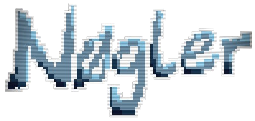

# Nogler's frontend web

This will be the frontend web for "Nogler", a multiplayer game based on "balatro" by LocalThunk, focused on creating a entertaining experience for players, in a multiplayer environment. It will maintain some of the original features, and the core game idea, as well as make some adaptations for a better multiplayer experience.

## Authors

- [@VictorOrrios](https://github.com/VictorOrrios)
 
- [@Ruben123454](https://github.com/Ruben123454)

- [@JSerranom04](https://github.com/JSerranom04)

## Core dependencies

npm version 10.8.x+

The remaining dependencies can be found on package-lock.json

## Setup

Download the repository and install the dependencies:

```
git clone git@github.com:UNIZAR-30226-2025-04/Frontend-web.git
cd Frontend-web
npm install
```

## Deployment

To deploy this project run:

```
npm run build
npm run preview
```
